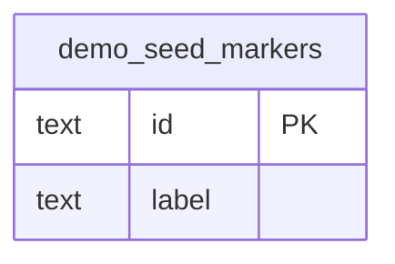

# Database state

The first migration contains a deliberately small `demo_seed_markers` table to exercise migrations and the guarded, idempotent development seed. It contains no students, schedules or campus claims. Drizzle maintains the migration journal separately.

This is a foundation schema, not the product schema. Identity, academic, room, group, scheduling, resource, exam, notification and moderation tables from specification Section 4 are still required. Add their migrations within their vertical modules after interface review.

Applied SQL migration hashes and timestamps must match the checked-in journal for database readiness. Never edit an applied migration after release; add a corrective migration instead.
